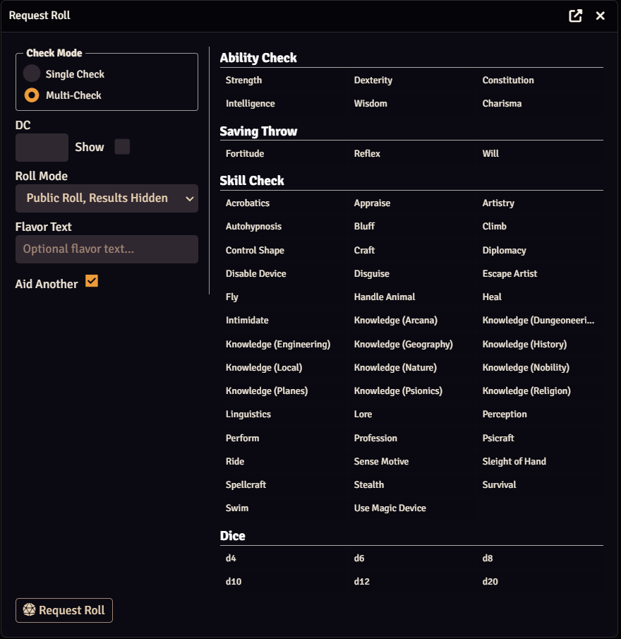
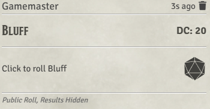
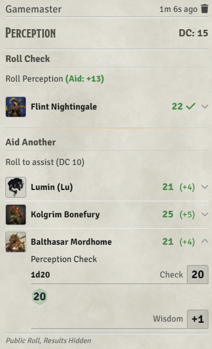

# PF1e Roll Requests

A Foundry VTT module for the PF1e system that lets the GM request rolls from players via interactive chat cards.

**Manifest URL:** `https://github.com/Hamilcarbarcas/pf1-roll-requests/releases/latest/download/module.json`

## Requirements

- Foundry VTT v13+
- PF1e system v11.10+

## Features






### Roll Request Dialog

A GM-only dialog accessed via the dice button in the token controls toolbar, or by calling `game.pf1RollRequests.requestRoll()` from a macro.

The dialog lets you select:

- **Check type** — Ability checks, saving throws, skill checks, or raw dice
- **Mode** — Single-check or multi-check
- **DC** — Optional; can be shown or hidden from players
- **Roll mode** — Public, GM-only, or blind roll. Selecting a blind roll mode automatically unchecks Aid Another (blind rolls imply the GM doesn't want player participation in the result).
- **Result visibility** — Whether pass/fail indicators are shown to players
- **Aid Another** — Whether other players can aid (single-check mode only; forced off for saves and dice)
- **Flavor text** — Optional label shown on the chat card

### Chat Cards

**Single-check mode:** One player rolls the primary check. Other players can contribute Aid Another rolls (DC 10) that add +2 each to the primary roll's total. Results update in real time.

**Multi-check mode:** Any number of players can each roll independently. Each result is appended to the card as it comes in.

The GM always sees the DC and pass/fail results. Players see them only if the GM enabled visibility for that request.

### Auto Save Requests

When a PF1e attack action that includes a saving throw is posted to chat, the module automatically converts it into an embedded targeted roll-request card. The original spell/attack card header and footer (damage buttons, effect notes, etc.) are preserved around the roll-request section.

This feature is enabled by default and can be toggled in **Settings → Module Settings → Auto-Request Saving Throws**.

**GM view:**

- Each targeted token gets a compact row with their portrait, name, and a roll button.
- **Roll All** — rolls the saving throw for every unrolled target, skipping the roll dialog. Also available for blind-roll targeted cards created via the API.
- **Roll NPCs** — like Roll All, but skips any NPC token that an active player has ownership of (so player-owned creatures roll themselves).
- **Select All / Select Passed / Select Failed** — canvas token-selection shortcuts that highlight the relevant tokens based on current results.
- Clicking any token portrait selects that token on the canvas.
- When there is only one target, all bulk and selection buttons are suppressed (no point in Roll All or Select Passed with a single token).

**Player view:**

- Tokens the player has at least Observer permission on appear as normal rows with a roll button.
- Tokens the player can see but lacks Observer permission on appear as a compact centered portrait grid (names and results hidden).
- Tokens that are hidden from the player are removed from the card entirely.

### API

Other modules can create roll requests programmatically:

```js
// Basic request
game.pf1RollRequests.createRequest({
  type: "skill",  // "ability", "save", "skill", or "dice"
  key: "per",     // system key (e.g. "str", "ref", "per", "d20")
  dc: 15,
});

// Full options (multi / single mode)
game.pf1RollRequests.createRequest({
  type: "skill",
  key: "dip",
  dc: 20,
  mode: "single",       // "single", "multi", or "targeted" (default: "multi")
  showDC: false,        // show DC to players (default: false)
  showResults: false,   // show pass/fail to players (default: false)
  rollMode: "roll",     // "roll", "gmroll", or "blindroll" (default: "roll")
  flavor: "Diplomacy",  // optional flavor text
  includeAid: true,     // include Aid Another section (default: true; forced off for saves and dice)
  awaitResult: true,    // return a Promise with the roll result (single mode only)
});

// Targeted mode — pin specific actors/tokens to the card
const message = await game.pf1RollRequests.createRequest({
  type: "save",
  key: "fort",
  dc: 15,
  mode: "targeted",
  showDC: true,
  showResults: true,
  flavor: "Massive Damage Save",
  targetedActors: [{ id: tokenDoc.id }],
});

// After setting any pending-result tracking, you can auto-roll all targets:
await game.pf1RollRequests.bulkRollTargeted(message);
```

`mode: "targeted"` pins one or more specific tokens to the card rather than letting any player roll. Returns the created chat message.

Each `targetedActors` entry requires only `id` (the token document ID). All other fields are automatically resolved from the canvas token:

| Field | Auto-resolved from | Override effect |
|---|---|---|
| `tokenUUID` | `tokenDoc.uuid` | Use a different token document for actor/ownership lookup |
| `name` | `tokenDoc.name` | Show a different display name on the card |
| `img` | `tokenDoc.texture.src` (falls back to actor portrait) | Show a different portrait |
| `isHidden` | `tokenDoc.hidden` | Force a token visible or hidden on the card regardless of its canvas state |

`game.pf1RollRequests.bulkRollTargeted(message)` rolls all pending targets on a targeted card without a dialog, exactly like the Roll All button. Call it after any pending-result bookkeeping is in place.

When `awaitResult: true` is set (single-check mode only), `createRequest` returns a Promise that resolves with the roll result object once a player completes the roll, or `null` if the chat card is deleted before completion.

### Hook

`pf1RollRequests.rollComplete` fires whenever a roll is completed on a request card, passing the message ID, roll type, result data, and updated flags.
