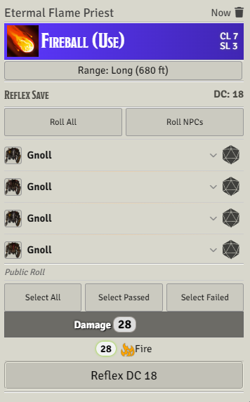

# PF1 Roll Requests

A Foundry VTT module for the PF1e system that lets the GM request rolls from players via interactive chat cards.

**Manifest URL:** `https://github.com/Hamilcarbarcas/pf1-roll-requests/releases/latest/download/module.json`

## Requirements

- Foundry VTT v13
- PF1e system v11.10

## Features

### Roll Request Dialog

A GM-only dialog accessed via the dice button in the token controls toolbar, or by calling `game.pf1RollRequests.requestRoll()` from a macro.

The dialog lets you select:

- **Check type** — Ability checks, saving throws, skill checks, or raw dice
- **Mode** — Single-check, multi-check, or selection-check (prompt specific actors)
- **DC** — Optional; can be shown or hidden from players
- **Roll mode** — Public, GM-only, or blind roll.
- **Result visibility** — Whether pass/fail indicators are shown to players
- **Aid Another** — Whether other players can aid (single-check mode only; forced off for saves and dice)
- **Flavor text** — Optional label shown on the chat card

#### Prompt Actors (Selection Check)

In **Selection Check** mode a checklist of actors appears. It is rebuilt each time the dialog opens from two sources:

- **Configured player characters** — every non-GM user's assigned character (including offline players). Always listed.
- **Player-owned NPCs** — NPC-type actors that a player owns (Owner permission) and that have a *linked* token on the scene you are currently viewing. These cover cohorts, animal companions, familiars, and similar — no per-actor setup is needed beyond the ownership you already grant. Rows from this source are marked with a paw icon. If no scene is active, none are added.

To hide a player-owned NPC you don't want prompted, **right-click its row** and choose **Exclude from List**. Excluded actors are stored per-world and can be reviewed or restored under **Settings → Module Settings → Manage Excluded Actors**.

### Chat Cards

 

**Single-check mode:** One player rolls the primary check. Other players can contribute Aid Another rolls (DC 10) that add +2 each to the primary roll's total, if enabled. Results update in real time.

**Multi-check mode:** Any number of players can each roll independently. Each result is appended to the card as it comes in.

The GM always sees the DC and pass/fail results. Players see them only if the GM enabled visibility for that request.

**Result aggregate:** On multi-check and selection-check cards, an optional line below the title/DC can show the running **highest** or **average** of the roll totals, updating live as results arrive (it appears once more than one result is in). Choose *None* (default), *Average result*, or *Highest result* under **Settings → Module Settings → Multi-Check Result Aggregate**. The average is rounded to the nearest whole number, and the line follows the same visibility as the totals themselves — the GM always sees it, and players see it unless the card hides totals (obscured/blind rolls).

**Rolling without a selected token:** Clicking a roll button rolls for your currently selected token. By default, when no token is selected it instead rolls for the actor set in your User Configuration; the GM can disable this under **Settings → Module Settings → Use Configured Actor When None Selected**, in which case clicking with no token selected warns you to select one. This does not affect per-target roll buttons on targeted cards, which are always tied to a specific token.

### Auto Save Requests

When a PF1e attack action that includes a saving throw is posted to chat, the module automatically converts it into an embedded targeted roll-request card. The original spell/attack card header and footer (damage buttons, effect notes, etc.) are preserved around the roll-request section.

This feature is enabled by default and can be toggled in **Settings → Module Settings → Auto-Request Saving Throws**.

**GM view:**

- Each targeted token gets a compact row with their portrait, name, and a roll button.
- **Roll All** — rolls the saving throw for every unrolled target, skipping the roll dialog. Also available for blind-roll targeted cards created via the API.
- **Roll NPCs** — like Roll All, but skips any NPC token that an active player has ownership of (so player-owned creatures roll themselves).
- **Select All / Select Passed / Select Failed** — canvas token-selection shortcuts that highlight the relevant tokens based on current results.
- Clicking any token portrait selects that token on the canvas.
- Clicking a target's **row** expands a collapsible dropdown. Before a roll it shows that creature's defenses; after a roll it shows the roll breakdown on top with the defenses below. Defenses include AC / touch / FF AC, CMD / flat-footed CMD, all three saving throws, plus spell resistance, damage reduction, energy resistance, active conditions, and any AC / CMD / save notes.
- When there is only one target, all bulk and selection buttons are suppressed (no point in Roll All or Select Passed with a single token).

**Player view:**

- Tokens the player has at least Observer permission on appear as normal rows with a roll button. Clicking the token's **row** expands the same dropdown available to the GM (defenses, plus the roll breakdown once rolled).
- Tokens the player can see but lacks Observer permission on appear as a compact centered portrait grid (names and results hidden).
- Tokens that are hidden from the player are removed from the card entirely.

#### Quick Actions

An optional **Quick Actions** category at the bottom of the options grid holds common, pre-configured rolls. Unlike the other categories, clicking a Quick Action **executes immediately** with its own baked-in settings — it ignores the left-hand panel and does not wait for the **Request Roll** button. This category can be enabled or disabled in the mod settings.

Available Quick Actions:

- **Spot Checks** — prompts a Perception check from selected actors. Opens an actor picker (the same list as Prompt Actors, all selected by default), then posts a **public** request card whose roll totals are hidden from players (the GM sees them), with no DC and no Aid Another.
- **Monster Lore** — opens the Monster Lore window (see below) instead of posting a card directly, and closes the Roll Request dialog.

Custom quick actions can be made via the mod API.

#### Monster Lore

A GM-only window (opened from the **Monster Lore** Quick Action) for running a Knowledge check to identify a monster. Pick a **monster type**, **CR**, and **rarity** (Common/Normal/Rare); a reference monster can be set by selecting a token or dragging an actor onto the drop zone (auto-filled on open from a single selected token), which auto-populates **CR** and **creature type** — sync re-pulls, clear removes it.

The type selects the relevant Knowledge skill — Arcana (constructs, dragons, magical beasts), Dungeoneering (aberrations, oozes), Local (humanoids), Nature (animals, fey, monstrous humanoids, plants, vermin), The Planes (outsiders), Religion (undead). **Request Knowledge Checks** then fires a **public multi-check** (Aid Another off); DC = rarity base (5/10/15) + CR (fractional CRs count as 1), hidden from players while results are public.

The card shows a live **"Questions earned"** tally (via the card-summary system): each passing check earns 1 question, +1 per full 5 by which it beats the DC, tallied across the party as results come in.

#### Configuring Roll Options

Under **Settings → Module Settings → Configure Roll Options** you can show or hide:

- **Whole categories** — Ability Checks, Saving Throws, Skill Checks, Dice, and Quick Actions.
- **Individual Quick Actions** — toggle each entry on or off (applies only while the Quick Actions category is shown).

### API

Other modules and macros can drive Roll Requests programmatically — creating requests, streaming multi-check results, and registering Quick Actions, card summaries, and hooks. See **[api.md](api.md)** for the full developer reference.
