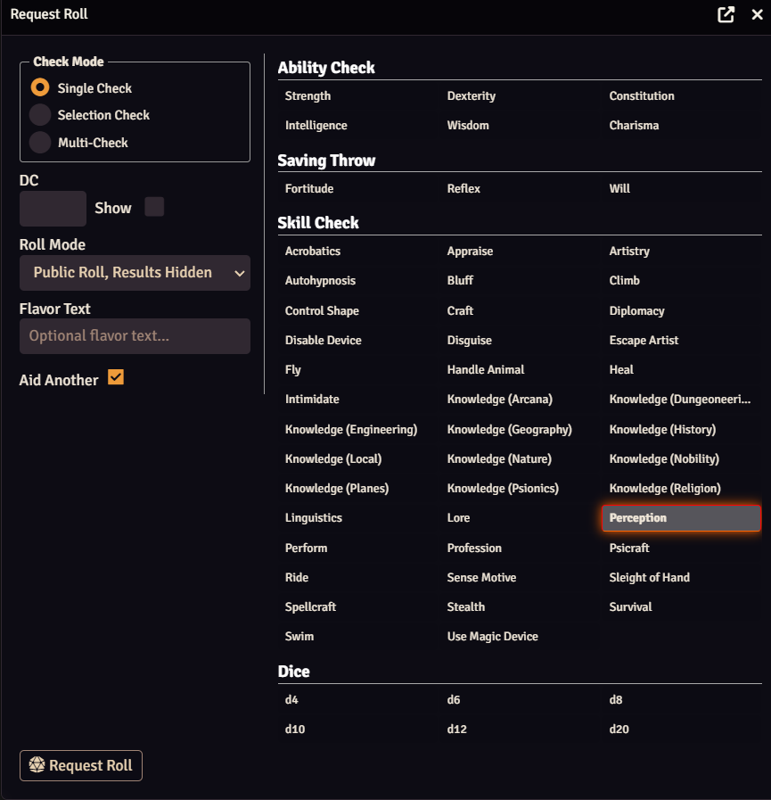
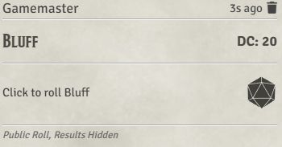
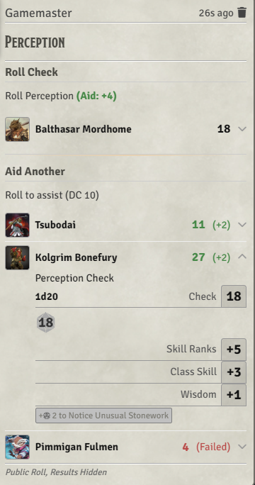

# PF1e Roll Requests

A Foundry VTT module for the PF1e system that lets the GM request rolls from players via interactive chat cards.

**Manifest URL:** `https://github.com/Hamilcarbarcas/pf1-roll-requests/releases/latest/download/module.json`

## Requirements

- Foundry VTT v13+
- PF1e system v11.10+

## Features






### Roll Request Dialog

A GM-only dialog accessed via the dice button in the token controls toolbar, or by calling `game.pf1RollRequests.requestRoll()` from a macro.

The dialog lets you select:

- **Check type** — Ability checks, saving throws, skill checks, or raw dice
- **Mode** — Single-check, multi-check, or selection-check (prompt specific actors)
- **DC** — Optional; can be shown or hidden from players
- **Roll mode** — Public, GM-only, or blind roll. Selecting a blind roll mode automatically unchecks Aid Another (blind rolls imply the GM doesn't want player participation in the result).
- **Result visibility** — Whether pass/fail indicators are shown to players
- **Aid Another** — Whether other players can aid (single-check mode only; forced off for saves and dice)
- **Flavor text** — Optional label shown on the chat card

#### Prompt Actors (Selection Check)

In **Selection Check** mode a checklist of actors appears. It is rebuilt each time the dialog opens from two sources:

- **Configured player characters** — every non-GM user's assigned character (including offline players). Always listed.
- **Player-owned NPCs** — NPC-type actors that a player owns (Owner permission) and that have a *linked* token on the scene you are currently viewing. These cover cohorts, animal companions, familiars, and similar — no per-actor setup is needed beyond the ownership you already grant. Rows from this source are marked with a paw icon. If no scene is active, none are added.

To hide a player-owned NPC you don't want prompted, **right-click its row** and choose **Exclude from List**. Excluded actors are stored per-world and can be reviewed or restored under **Settings → Module Settings → Manage Excluded Actors**.

#### Quick Actions

A **Quick Actions** category at the bottom of the options grid holds common, pre-configured rolls. Unlike the other categories, clicking a Quick Action **executes immediately** with its own baked-in settings — it ignores the left-hand panel and does not wait for the **Request Roll** button.

Available Quick Actions:

- **Spot Checks** — prompts a Perception check from selected actors. Opens an actor picker (the same list as Prompt Actors, all selected by default), then posts a **public** request card whose roll totals are hidden from players (the GM sees them), with no DC and no Aid Another.

#### Configuring Roll Options

Under **Settings → Module Settings → Configure Roll Options** you can show or hide:

- **Whole categories** — Ability Checks, Saving Throws, Skill Checks, Dice, and Quick Actions.
- **Individual Quick Actions** — toggle each entry on or off (applies only while the Quick Actions category is shown).

### Chat Cards

**Single-check mode:** One player rolls the primary check. Other players can contribute Aid Another rolls (DC 10) that add +2 each to the primary roll's total. Results update in real time.

**Multi-check mode:** Any number of players can each roll independently. Each result is appended to the card as it comes in.

The GM always sees the DC and pass/fail results. Players see them only if the GM enabled visibility for that request.

### Auto Save Requests

When a PF1e attack action that includes a saving throw is posted to chat, the module automatically converts it into an embedded targeted roll-request card. The original spell/attack card header and footer (damage buttons, effect notes, etc.) are preserved around the roll-request section.

This feature is enabled by default and can be toggled in **Settings → Module Settings → Auto-Request Saving Throws**.

**GM view:**

- Each targeted token gets a compact row with their portrait, name, and a roll button.
- **Roll All** — rolls the saving throw for every unrolled target, skipping the roll dialog. Also available for blind-roll targeted cards created via the API.
- **Roll NPCs** — like Roll All, but skips any NPC token that an active player has ownership of (so player-owned creatures roll themselves).
- **Select All / Select Passed / Select Failed** — canvas token-selection shortcuts that highlight the relevant tokens based on current results.
- Clicking any token portrait selects that token on the canvas.
- Clicking a target's **row** expands a collapsible dropdown. Before a roll it shows that creature's defenses; after a roll it shows the roll breakdown on top with the defenses below. Defenses include AC / touch / FF AC, CMD / flat-footed CMD, all three saving throws, plus spell resistance, damage reduction, energy resistance, active conditions, and any AC / CMD / save notes.
- When there is only one target, all bulk and selection buttons are suppressed (no point in Roll All or Select Passed with a single token).

**Player view:**

- Tokens the player has at least Observer permission on appear as normal rows with a roll button. Clicking the token's **row** expands the same dropdown available to the GM (defenses, plus the roll breakdown once rolled).
- Tokens the player can see but lacks Observer permission on appear as a compact centered portrait grid (names and results hidden).
- Tokens that are hidden from the player are removed from the card entirely.

### API

Other modules can create roll requests programmatically:

```js
// Basic request
game.pf1RollRequests.createRequest({
  type: "skill",  // "ability", "save", "skill", or "dice"
  key: "per",     // system key (e.g. "str", "ref", "per", "d20")
  dc: 15,
});

// Full options (multi / single mode)
game.pf1RollRequests.createRequest({
  type: "skill",
  key: "dip",
  dc: 20,
  mode: "single",       // "single", "multi", or "targeted" (default: "multi")
  showDC: false,        // show DC to players (default: false)
  showResults: false,   // show pass/fail to players (default: false)
  rollMode: "roll",     // "roll", "gmroll", or "blindroll" (default: "roll")
  flavor: "Diplomacy",  // optional flavor text
  includeAid: true,     // include Aid Another section (default: true; forced off for saves and dice)
  awaitResult: true,    // return a Promise with the roll result (single mode only)
  onResult: (payload) => {},  // streaming callback fired on every roll (any mode; best for "multi")
});

// Targeted mode — pin specific actors/tokens to the card
const message = await game.pf1RollRequests.createRequest({
  type: "save",
  key: "fort",
  dc: 15,
  mode: "targeted",
  showDC: true,
  showResults: true,
  flavor: "Massive Damage Save",
  targetedActors: [{ id: tokenDoc.id }],
});

// After setting any pending-result tracking, you can auto-roll all targets:
await game.pf1RollRequests.bulkRollTargeted(message);
```

`mode: "targeted"` pins one or more specific tokens to the card rather than letting any player roll. Returns the created chat message.

Each `targetedActors` entry requires only `id` (the token document ID). All other fields are automatically resolved from the canvas token:

| Field | Auto-resolved from | Override effect |
|---|---|---|
| `tokenUUID` | `tokenDoc.uuid` | Use a different token document for actor/ownership lookup |
| `name` | `tokenDoc.name` | Show a different display name on the card |
| `img` | `tokenDoc.texture.src` (falls back to actor portrait) | Show a different portrait |
| `isHidden` | `tokenDoc.hidden` | Force a token visible or hidden on the card regardless of its canvas state |

`game.pf1RollRequests.bulkRollTargeted(message)` rolls all pending targets on a targeted card without a dialog, exactly like the Roll All button. Call it after any pending-result bookkeeping is in place.

When `awaitResult: true` is set (single-check mode only), `createRequest` returns a Promise that resolves with the roll result object once a player completes the roll, or `null` if the chat card is deleted before completion.

#### Streaming results from a multi-check (`onResult`)

A multi-check has no single "done" moment — any number of actors roll whenever they like — so instead of a Promise it takes an `onResult` callback, invoked on **every** roll completed on the card. `createRequest` also returns the created `ChatMessage` in `multi` mode, so you have a handle to read flags or correlate with the hook.

```js
const message = await game.pf1RollRequests.createRequest({
  type: "skill", key: "kna", dc: 18, mode: "multi", includeAid: true,
  flavor: "Identify Monster Components",
  onResult: ({ result, results, dc }) => {
    // `result` = the entry just rolled; `results` = every primary entry so far.
    // Both carry a computed `passed` (total >= dc, or null when no DC).
    const best = results.reduce((b, r) => (r.total > b.total ? r : b));
    console.log(`Best so far: ${best.actorName} rolled ${best.total} (${best.passed ? "pass" : "fail"})`);
  },
});
```

Callback payload: `{ messageId, rollType, result, results, aidResults, dc }`. `rollType` distinguishes primary multi rolls (`"multi"`) from Aid Another rolls (`"multiAid"`). The callback runs on the GM client that created the request (even when a player performs the roll); like `awaitResult` it is held in memory, so a GM reload mid-sequence drops it (the card and its stored results persist).

**Terminal event.** If the chat card is deleted, `onResult` fires one final time with `rollType: "cancelled"` and a `reason` (currently `"deleted"`), so you can tear down. This terminal payload is empty-shaped — `result: null`, `results: []`, `aidResults: []` — so always branch on `rollType` before reading the roll fields:

```js
onResult: (payload) => {
  if (payload.rollType === "cancelled") return; // or clean up; payload.reason tells you why
  // ...payload.result / payload.results are guaranteed populated here...
}
```

(A GM reload still drops the callback silently — there's no memory left to fire from — so `"cancelled"` covers deletion, not reload.)

### Registering Quick Actions

Other modules can contribute their own buttons to the **Quick Actions** category. The module decides entirely what the button does — this API only provides the slot and, optionally, the actor selection.

```js
game.pf1RollRequests.registerQuickAction({
  key: "my-mod-darkvision-check",   // required, unique
  label: "Darkvision Check",        // button label (defaults to key)
  icon: "fa-eye-low-vision",        // optional Font Awesome icon (default: fa-bolt)
  promptActors: true,               // optional: show the actor picker first (default: false)
  allActors: false,                 // optional: pass all eligible actors without prompting
                                    //           (default: false; ignored if promptActors is true)
  closeOnUse: false,                // optional: close the dialog afterwards (default: false)
  callback: ({ app, actors, event }) => {
    // app    — the RollRequestDialog instance (call app.close() to dismiss it,
    //          or app.getEligibleActors() for the full eligible list)
    // actors — [{ id, name, img }]: the picker selection (promptActors) or the full
    //          eligible list (allActors); null when neither option is set
    // event  — the originating click event
    myModule.doSomething(actors);
  },
});
```

The three actor-passing modes are mutually ordered: `promptActors` (show picker) takes precedence, then `allActors` (send everyone), otherwise `actors` is `null`.

- Register during the `ready` hook (or later) so `game.pf1RollRequests` exists.
- The `callback` may be async; it is awaited, and the dialog is closed afterward only if `closeOnUse` is `true` (you can also call `app.close()` yourself at any time).
- Registered actions appear in **Configure Roll Options** and can be hidden there like the built-ins.
- `game.pf1RollRequests.unregisterQuickAction(key)` removes one; `game.pf1RollRequests.getQuickActions()` returns the current list.

### Card Summaries (live aggregates)

A request can display a running aggregate line in its card — for example, a cumulative tally derived from every roll as results come in. Register a formatter and reference it by key on the request:

```js
// Register once (e.g. in your "ready" hook)
game.pf1RollRequests.registerSummary("monster-lore", (flags) => {
  const dc = flags.dc;
  let questions = 0;
  for (const r of Object.values(flags.rolledActors ?? {})) {
    if (dc != null && r.total >= dc) questions += 1 + Math.floor((r.total - dc) / 5);
  }
  return `<strong>Questions earned:</strong> ${questions}`;
});

// Then create a request that uses it
game.pf1RollRequests.createRequest({
  type: "skill", key: "kna", dc: 18,
  mode: "multi",
  summaryKey: "monster-lore",
});
```

- The formatter receives the card's current `flags` (including `rolledActors`, `dc`, `rollMode`, etc.) and returns an HTML string, or `""` for nothing. **Recompute from the results each call** rather than accumulating — the formatter runs on every roll, so it stays correct through re-rolls or deletions.
- The summary is recomputed and re-rendered automatically on every roll result.
- **Player visibility follows `showResults`**: when results are hidden from players (`showResults: false`), the summary is GM-only; when results are public, players see it too.
- The summary slot is present in all card types (single, multi-check, and targeted).
- `game.pf1RollRequests.unregisterSummary(key)` removes a formatter.

### Hook

`pf1RollRequests.rollComplete` fires whenever a roll is completed on a request card, passing the message ID, roll type, result data, and updated flags.
